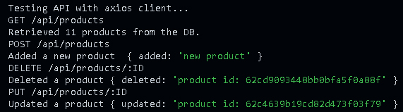
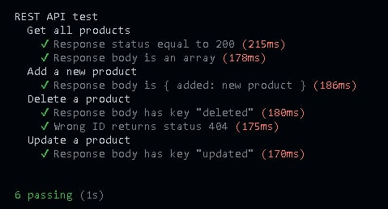

# Clase 42 - Testing

## Test manual
    Cliente Axios: node ./tests/client/index
    Resultado:
    []

## Test con Mocha, Chai y Supertest
    mocha ./tests/api.test.js

    Resultado:
    []

## Nodemon:
    Modo fork: nodemon server --port xxxx
    Modo cluster: nodemon server --port xxxx --mode cluster

## Forever:
    Modo fork: forever start server.js --port xxxx
    Modo cluster: forever start server.js --mode cluster

## PM2:
    Modo fork: pm2 start server.js --name="ServerX" -- -port xxxx
    Modo cluster: pm2 start server.js -i max

## Para probar NGINX: 
    - Levantar los servers express con: 
        1) forever start server.js --port 8080
        2) forever start server.js --port 8082
        3) forever start server.js --port 8083
        4) forever start server.js --port 8084
        5) forever start server.js --port 8085
    - Abrir ./nginx-1.23.1/nginx.exe
    - Abrir localhost:8081 en un explorador.